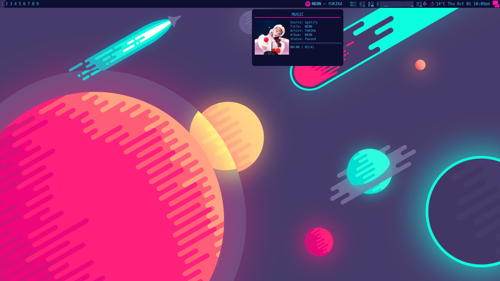
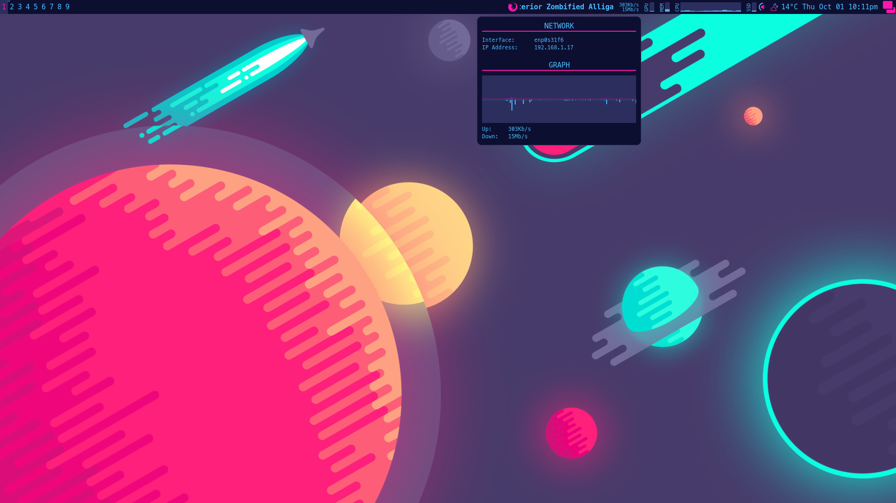
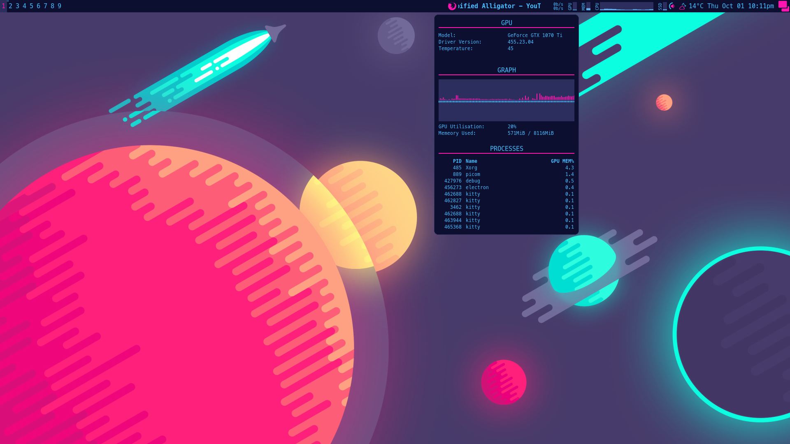
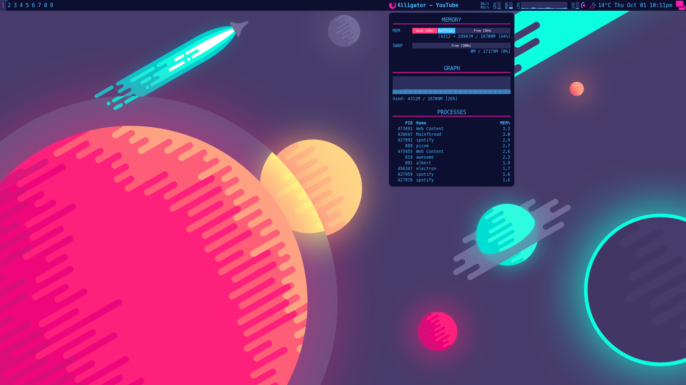
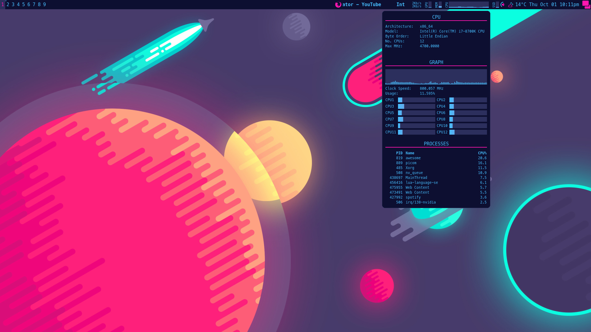
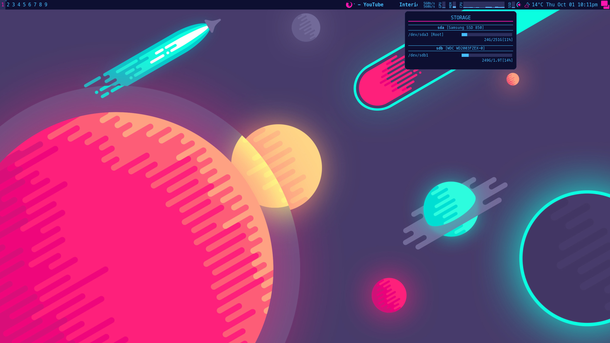
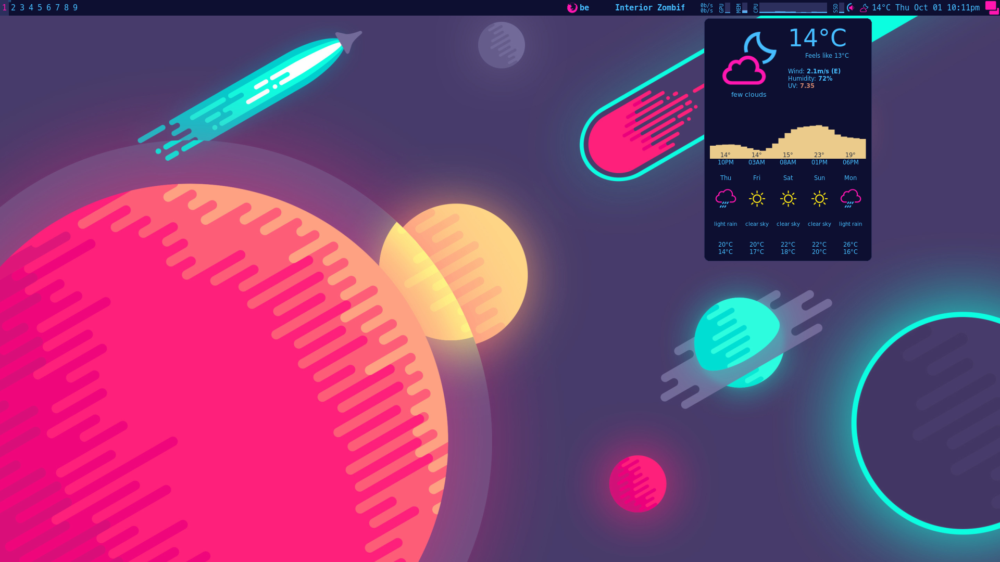

# Widgets

## Gallery

### Music

Details
- Monitors most recent player
- Display Widget shows Player Icon (spotify, youtubemusic, firefox, chrome), song title, artist
- Popup Widget shows Album Art (tested spotify, youtubemusic), song title, artist, album, status, progress
- Uses [playerctl](https://github.com/altdesktop/playerctl) and curl to download album art

### Network

Details
- Monitors network traffic
- Display Widget shows up speed and down speed respectively
- Popup Widget shows chosen network interface, ip address, history graph
- Uses ifconfig to get info, and /sys/class/net to collect rx and tx bytes in shell
- TODO: Network Processes (eg, nethogs)

### GPU

Details
- Monitors GPU Usage 
- Display Widget shows GPU memory used %
- Popup Widget shows gpu model, driver version, temperature, gpu utilisation and memory used graph, and top processes
- Requires nvidia-smi

### Memory

Details
- Monitors Memory/RAM/Swap Usage 
- Display Widget shows % memory used 
- Popup Widget shows used|buff/cachce|free for memory and swap, memory used graph, and top processes
- Uses free and ps shell commands

### CPU

Details
- Monitors CPU Usage 
- Display Widget shows cpu0 (total), and cpu1-N utilisation, from left to right
- Popup Widget shows cpu info (eg, architecture, model, byte order, no. cpus, max MHz, cpu utilisation graphs, and top processes
- Uses lscpu (cpu info), /proc/stat (cpu usage), ps (top processes) shell commands

### Storage

Details
- Monitors Storage Space
- Display Widget shows primary storage (/) space
- Popup Widget primary storage and other drives/partitions if specified
- Uses df shell command

### Weather

Details
- Sourced from [awesome-wm-widgets](https://github.com/streetturtle/awesome-wm-widgets/tree/master/weather-widget)
- Uses [OpenWeatherMap API](https://openweathermap.org/)
- Changed colour scheme of icons

### Calendar/Clock

Details
- Nothing special, just Awesome API right now

### Volume
- No Image (since no popup)

Details
- Sourced and modified from [deficient/volume-control](https://github.com/deficient/volume-control)
- I used amixer (alsa) batched with keybindings and custom volume icons (mute, zero, normal) for the display widget

## Summary

Widget | Shell Command, Tool
--- | ---
Clock | [Awesome API](https://awesomewm.org/doc/api/classes/wibox.widget.textclock.html#)
CPU | lscpu, cat /proc/stat, ps
GPU | nvidia-smi
Memory | free, ps
Music | [playerctl](https://github.com/altdesktop/playerctl)
Net | ifconfig, cat /sys/class/net/
Storage | df
Volume | [amixer](https://wiki.archlinux.org/index.php/Advanced_Linux_Sound_Architecture)
Weather | [OpenWeatherMap API](https://openweathermap.org/)
