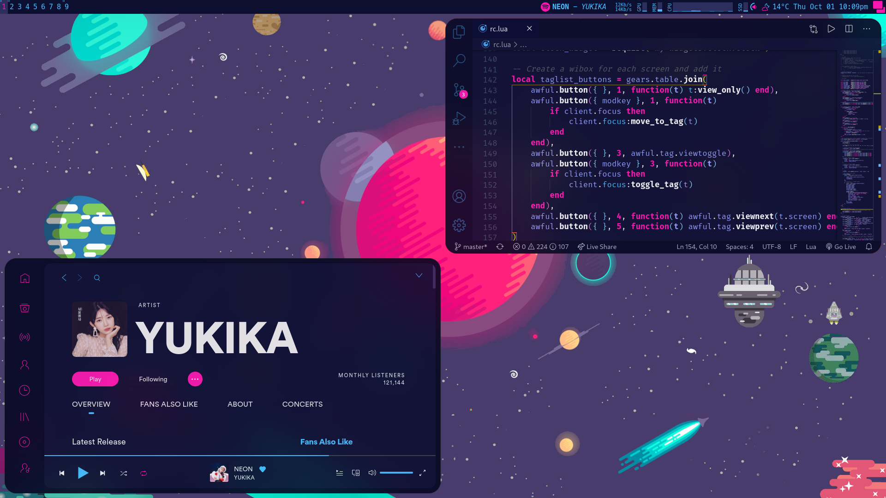

# JimmeeX dotfiles

Joining the Arch Linux userbase for the first time.

## Gallery

## General Details
- OS: Arch Linux
- Wallpapers: Credits to [Kurzgesagt](https://kurzgesagt.org/)
- Window Manager: [Awesome](https://awesomewm.org/)
- Compositor: [Picom Fork](https://github.com/ibhagwan/picom)

## Apps
- Terminal: [Kitty](https://sw.kovidgoyal.net/kitty/) (config provided)
- Shell: zsh with [powerlevel10k](https://github.com/romkatv/powerlevel10k) (zsh & p10k config provided)
- File Manager: [ranger](https://wiki.archlinux.org/index.php/Ranger) (config provided)
- Browser: Firefox (customised with [Firefox Color](https://color.firefox.com/))
- Text Editor: VS Code ([1984 color theme](https://github.com/juanmnl/vs-1984))
- Application Launcher: [Albert](https://albertlauncher.github.io/) (config provided)
- Music Player: [Spotify](https://aur.archlinux.org/packages/spotify/) customised with spicetify (config provided)
- Widgets: Music, Net, GPU, Memory, CPU, Storage, Weather. More details [here](https://github.com/JimmeeX/dotfiles/tree/master/.config/awesome/my-widgets).

## Inspirations
- [Kurolox](https://www.reddit.com/r/unixporn/comments/ho05vh/bspwm_space/) (Pretty much most things)
- [Neon 80s](https://www.reddit.com/r/unixporn/comments/c0i8e1/i3gaps_neon_80s/) (colour theme)
- [iStat Menus 6](https://bjango.com/mac/istatmenus/) (Monitoring Widgets)
- [Mechanical Love](https://www.reddit.com/r/unixporn/comments/a900p7/awesome_mechanical_love/)
